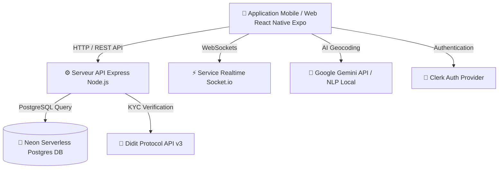

# 🚗 VORA — Next-Gen Urban Mobility & Smart VTC Platform (African Context)

<div align="center">


**Développé par l'équipe TEAM-VANGUARD pour le Nuxcine Hackathon 🚀**

</div>

---

## 📖 Présentation du Projet

**VORA** est une plateforme moderne de transport urbain (VTC / Moto-taxi / Voiture) spécifiquement conçue pour le contexte africain et camerounais. Elle résout les défis majeurs des villes en développement : l'absence d'adressage postal formel, la sécurité des passagers/chauffeurs, et le paiement par Mobile Money.

Elle combine un **Frontend Web & Mobile ultra-réactif sous React Native & Expo Router** (`/mobile`) avec un **Backend Node.js/Express résilient connecté à une base PostgreSQL / Neon Serverless** (`/backend`).

---

## 🌟 Fonctionnalités Majeures & Innovations VANGUARD

### 🧠 1. Géolocalisation par IA & Langage Naturel Informel (Innovation Majeure)
- **Le Problème** : Au Cameroun, personne n'utilise de numéros ni de noms de rue formels ("12 Rue de la Paix" n'existe pas dans le quotidien). On utilise des repères informels : *"derrière la pharmacie Mvog-Ada"*, *"en face de la boulangerie à Bastos"*, *"au carrefour Nlongkak"*.
- **La Solution VORA** : Un moteur d'IA basé sur **Google Gemini API** croisé avec un parseur NLP local. 
- **Fonctionnement** : L'utilisateur tape sa phrase naturellement dans la barre de recherche. L'IA décode le point d'ancrage (POI) et la relation spatiale (*derrière*, *en face*, *à côté*), applique un micro-offset spatial précis et génère le point GPS exact pour la prise en charge.

### 🗺️ 2. Cartographie & Calcul d'Itinéraires Geoapify (Sans Carte Bancaire)
- Utilisation de l'API **Geoapify Geocoding & Routing** pour calculer les durées de trajet et les tarifs réels sans dépendre des clés payantes Google Maps.
- Génération de cartes statiques (`RideCard.tsx`) et calcul de secours Haversine garantissant **0 crash** en cas d'absence de réseau.

### 🔒 3. Identifiant Anonymisé (`VORA-XXXXXX`)
- **Protection de la vie privée** : Les numéros de téléphone et emails personnels ne sont jamais exposés entre le chauffeur et le passager.
- Chaque utilisateur possède un identifiant anonymisé unique (ex. `VORA-A8F29C`) utilisé pour le matching, l'historique et le chat.

### 🛡️ 4. Vérification d'Identité Biométrique Didit KYC
- **Conformité & Sécurité renforcée** : Intégration du SDK Didit Protocol v3.
- Vérification instantanée par **pièce d'identité**, **liveness detection** et **face match**.
- Badge visuel dynamique sur le profil (*VÉRIFIÉ ✓*, *EN COURS...*, *NON VÉRIFIÉ*).

### 💳 5. Paiement Mobile Money & CamerPay (MTN & Orange Money)
- Support du paiement par **Cash**, **MTN Mobile Money** et **Orange Money**.
- Simulation et validation des transactions de paiement sécurisées via l'API `/api/camerpay`.

### 🤝 6. Confirmation Mutuelle de Fin de Course & Gestion des Litiges
- Cycle de vie sécurisé : `recherche` ➔ `acceptee` ➔ `arrivee_signalee` ➔ `terminee`.
- Validation bilatérale avec temporisateur intelligent de 5 minutes.
- En cas de désaccord, la course passe en statut `LITIGE` et remonte au tableau de bord administrateur.

### 📊 7. Dashboard Super Admin & Bouton SOS d'Urgence
- **Portail Administrateur (Dark Mode)** : Accès sécurisé par code PIN (`EXPO_PUBLIC_ADMIN_PIN`). Permet d'arbitrer les litiges, suivre les alertes SOS et gérer la plateforme.
- **Bouton SOS d'urgence** : Permet au passager ou chauffeur d'émettre une alerte géolocalisée immédiate en cas de danger.

---

## 📁 Structure du Projet

```text
VORA/
├── backend/                  # API Rest Express Node.js & Base PostgreSQL / Neon
│   ├── src/
│   │   ├── db/               # Schéma SQL, connecteur Neon et initialisation auto
│   │   ├── routes/           # Endpoints API (Users, Rides, Drivers, Disputes, CamerPay, Didit KYC, Admin, SOS)
│   │   ├── socket.ts         # Service Realtime Socket.io
│   │   └── server.ts         # Point d'entrée serveur Express
│   ├── .env                  # Conf backend (DATABASE_URL, PORT)
│   ├── package.json
│   └── tsconfig.json
│
├── mobile/                   # Application Mobile & Web Expo Router
│   ├── app/                  # Routes Expo Router ((auth), (driver), (root), (api))
│   ├── components/           # Composants UI (GoogleTextInput, Map, RideCard, Payment, etc.)
│   ├── constants/            # Constantes & Base des repères Camerounais (cameroon-landmarks.ts)
│   ├── lib/                  # Utilities (aiLocationParser, fetch, map, stripeSafe, useClerkSafe)
│   ├── store/                # Zustand State Management (location, driver, auth)
│   ├── .env                  # Conf mobile (Clerk, Geoapify, Gemini, Backend URL, Database URL)
│   └── package.json
│
├── .gitignore
└── README.md
```

---

## 🛠️ Architecture Technique



---

## 🚀 Guide d'Utilisation & Mode d'Emploi de l'Application

### 1️⃣ Lancement des Services

```bash
# Terminal 1 : Lancer le Backend API VORA
cd backend
npm run dev

# Terminal 2 : Lancer l'application Mobile/Web Expo
cd mobile
npx expo start --web --port 8082
```

---

### 2️⃣ Parcours Utilisateur Passager

1. **Connexion / Inscription** : 
   - Connectez-vous avec Google ou Email via **Clerk**. Un identifiant anonyme `VORA-XXXXXX` vous est attribué.
2. **Recherche de Destination par IA Informelle** :
   - Dans la barre de recherche de l'écran d'accueil, saisissez un lieu informel :
     * Exemples : `derrière la pharmacie de Mvog-Ada`, `en face de la boulangerie à Bastos`, `au carrefour Nlongkak`.
   - L'IA identifie instantanément le point de repère et positionne le curseur sur la carte.
3. **Choix du Chauffeur & Tarification** :
   - Sélectionnez un chauffeur disponible (Moto, Taxi, ou Confort) affiché sur la carte. Le tarif en FCFA et la durée du trajet sont calculés automatiquement.
4. **Paiement & Confirmation** :
   - Choisissez votre mode de paiement (**Cash**, **MTN MoMo**, **Orange Money**).
   - Validez la réservation pour lancer le suivi de la course en temps réel.

---

### 3️⃣ Parcours Chauffeur & Tableau de Bord

1. **Basculement en Mode Chauffeur** :
   - Accédez à l'onglet ou au tableau de bord Chauffeur (`/(driver)/dashboard`).
2. **Prise en Charge Temps Réel** :
   - Recevez les notifications de courses à proximité en temps réel grâce à **Socket.io**.
   - Suivez l'itinéraire et les instructions de prise en charge fournies par l'IA.
3. **Suivi des Gains** :
   - Consultez votre solde journalier, le total des courses effectuées et vos évaluations chauffeurs.

---

### 4️⃣ Espace Administrateur & Bouton SOS

1. **Portail Administration Discret** :
   - Sur le profil utilisateur, tapez **5 fois consécutives** sur la version de l'application.
   - Saisissez le code PIN Administrateur (`1234` par défaut dans le `.env`).
   - Accédez au tableau de bord de gestion des litiges et de supervision du réseau.
2. **Alerte d'Urgence SOS** :
   - En cas d'incident durant un trajet, cliquez sur le bouton rouge **SOS**.
   - L'alerte géolocalisée remonte immédiatement au serveur central et au tableau de bord administrateur.

---

## 👥 Équipe de Développement — TEAM-VANGUARD

- **Patrick Assako** (@patrickassako) — *Lead Developer & Co-auteur*
- **Legrand Onana** (@psycho237-prog) — *Fullstack Engineer & Contributeur*

---

<div align="center">
  <sub>Fait avec ❤️ par TEAM-VANGUARD pour le Hackathon Nuxcine — © 2026 VORA Mobility. Tous droits réservés.</sub>
</div>
