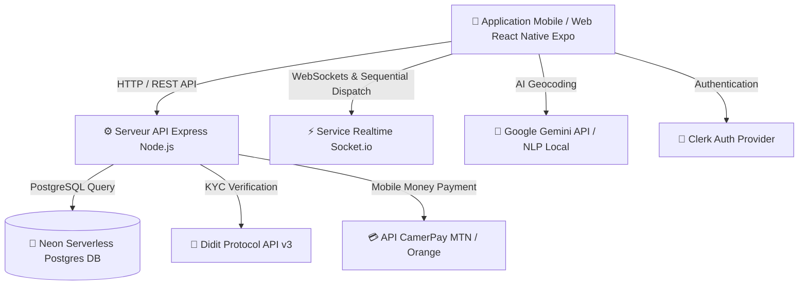

# 🚗 VORA — Next-Gen Urban Mobility & Smart VTC Platform (African Context)

<div align="center">


**Développé par l'équipe TEAM-VANGUARD pour le Nuxcine Hackathon 🚀**

</div>

---

## 📖 Présentation du Projet

**VORA** est une plateforme moderne de transport urbain (VTC / Moto-taxi / Voiture) spécifiquement conçue pour le contexte africain et camerounais. Elle résout les défis majeurs des villes en développement : l'absence d'adressage postal formel, la sécurité des passagers/chauffeurs, le dispatch efficace et le paiement sécurisé par Mobile Money.

Elle combine un **Frontend Web & Mobile ultra-réactif sous React Native & Expo Router** (`/mobile`) avec un **Backend Node.js/Express résilient connecté à une base PostgreSQL / Neon Serverless** (`/backend`).

---

## 🌟 Fonctionnalités Majeures & Innovations VANGUARD

### 🧠 1. Géolocalisation par IA & Langage Naturel Informel (Innovation Majeure)
- **Le Problème** : Au Cameroun, l'adressage formel par numéros de rue est quasi-inexistant. Les résidents utilisent des repères informels : *"derrière la pharmacie Mvog-Ada"*, *"en face de la boulangerie à Bastos"*, *"au carrefour Nlongkak"*.
- **La Solution VORA** : Un moteur d'IA basé sur **Google Gemini API** croisé avec un parseur NLP local. 
- **Fonctionnement** : L'utilisateur tape sa phrase naturellement. L'IA décode le point d'ancrage (POI) et la relation spatiale (*derrière*, *en face*, *à côté*), applique un micro-offset spatial précis et génère les coordonnées GPS exactes de prise en charge.

### 🚕 2. Tarification par Catégorie (3 Catégories) & Options Passagers / Bagages
- **3 Catégories de Véhicules** :
  1. **VORA Moto (Bendskin)** : Rapide & agile (Base 500 FCFA, 150 FCFA/km, 1 passager max).
  2. **VORA Taxi Classique** : Taxi jaune urbain (Base 1 000 FCFA, 250 FCFA/km, 1 à 4 passagers).
  3. **VORA Berline Confort** : Véhicule VIP climatisé (Base 2 000 FCFA, 400 FCFA/km, 1 à 4 passagers).
- **Options de Transport** :
  - **Nombre de passagers** : Choix flexible de 1 à 4 personnes.
  - **Surcharge Bagages** : Déclaration des valises/sacs (+300 FCFA par bagage).
- **Visibilité Chauffeur** : Le chauffeur visualises le nombre de personnes, la présence de bagages et la catégorie choisie avant d'accepter la course.

### 📈 3. Tarification Dynamique (Surge Pricing Horaires & Zones)
- **Majoration Horaires** :
  - Pointe Matin (07h00 - 09h00) : `+20%` (Surge `1.20x`).
  - Pointe Soir (17h00 - 20h00) : `+30%` (Surge `1.30x`).
  - Tarif Nuit (22h00 - 05h00) : `+25%` (Surge `1.25x`).
- **Majoration Zones à Forte Affluence** : Majoration automatique (+15%) dans les secteurs à très forte demande (*Bastos*, *Mokolo*, *Aéroport*, *Akwa*, *Bonanjo*).

### 📡 4. Dispatch Séquentiel Chauffeur en Cascade (Timer 20s & Ajustement d'Offre)
- **Tri par Proximité** : Le backend recherche et trie les chauffeurs en ligne par distance GPS croissante.
- **Cascade au Chauffeur le Plus Proche** : La demande est transmise au **1er chauffeur le plus proche** avec un **compte à rebours de 20 secondes**.
- **Transfert Automatique** : Si le 1er chauffeur refuse ou ne répond pas dans le délai imparti, la course est automatiquement transférée au chauffeur n°2 le plus proche.
- **Réajustement d'Offre Tarifaire** : Si tous les chauffeurs déclinent, une modale propose au passager d'**ajouter un pourboire** (+200 FCFA, +500 FCFA) ou de changer de catégorie pour relancer la recherche.

### 📑 5. Enregistrement Véhicule Chauffeur & Contrat de Partenariat VORA
- **Formulaire d'Enregistrement Véhicule** : Saisie de la marque, du modèle, de la plaque d'immatriculation, de la couleur et de la catégorie.
- **Contrat Partenaire Chauffeur VORA** :
  - Commission fixe de **15%** prélevée par VORA sur les courses (85% des gains conservés par le chauffeur).
  - Validation d'identité biométrique **Didit KYC** obligatoire pour passer "En Ligne".
  - Respect de l'anonymat et de la vie privée des passagers (`VORA-XXXXXX`).

### 📞 6. Appels Vocaux In-App dans le Chat (WebRTC)
- **Appel Audio Sécurisé** : Bouton d'appel audio direct dans la messagerie `chat.tsx` via WebRTC sans exposer le numéro de téléphone réel.
- **Interface d'Appel** : Overlay avec sonnerie, durée de communication, coupure micro et haut-parleur.

### 📸 7. Photos Géolocalisées des Lieux (Repères Visuels Communautaires)
- **Capture et Assignation** : Composant `LocationPhotoPicker.tsx` permettant d'assigner une photo réelle à un lieu de prise en charge (ex: *"Devant la pharmacie Bastos"*).
- **Galerie de Repères** : Affichage des vignettes de photos partagées par la communauté pour guider les passagers et chauffeurs.

### 💳 8. Portefeuille In-App (Wallet) & Paiement CamerPay (MTN & Orange Money)
- **Paiement Mobile Money Réel** : Intégration de l'API CamerPay (`https://camerpay.biz/api`) pour MTN MoMo et Orange Money.
- **Portefeuille In-App** : Recharge de solde, gestion des règlements direct et régularisation des frais d'annulation (500 FCFA après 2 min avec gestion du solde négatif/dette).

---

## 📁 Structure du Projet

```text
VORA/
├── backend/                  # API Rest Express Node.js & Base PostgreSQL / Neon
│   ├── src/
│   │   ├── db/               # Schéma SQL, connecteur Neon et initialisation auto
│   │   ├── routes/           # Endpoints API (Users, Rides, Drivers, Disputes, CamerPay, Didit, LocationPhotos)
│   │   ├── utils/            # Calculateur de tarif dynamique (pricing.ts), anonymisation
│   │   ├── socket.ts         # Dispatch séquentiel et signalisation WebRTC audio
│   │   └── server.ts         # Point d'entrée serveur Express
│   ├── .env                  # Conf backend (DATABASE_URL, PORT, CamerPay API Keys)
│   ├── package.json
│   └── tsconfig.json
│
├── mobile/                   # Application Mobile & Web Expo Router
│   ├── app/                  # Routes Expo Router ((auth), (driver), (root), (api))
│   ├── components/           # Composants UI (GoogleTextInput, VehicleTypeSelector, LocationPhotoPicker, CamerPaySelector)
│   ├── constants/            # Constantes & Base des repères Camerounais
│   ├── lib/                  # Utilities (aiLocationParser, vora-pricing, map, socket, useClerkSafe)
│   ├── store/                # Zustand State Management (location, driver, auth)
│   ├── .env                  # Conf mobile (Clerk, Geoapify, Gemini, CamerPay, Database URL)
│   └── package.json
│
├── .gitignore
└── README.md
```

---

## 🛠️ Architecture Technique



---

## 🚀 Guide d'Utilisation & Mode d'Emploi

### 1️⃣ Lancement des Services

```bash
# Terminal 1 : Lancer le Backend API VORA
cd backend
npm run dev

# Terminal 2 : Lancer l'application Mobile/Web Expo
cd mobile
npx expo start --web --port 8082
```

---

### 2️⃣ Parcours Passager

1. **Connexion & Inscription** : Connectez-vous via Clerk. Un identifiant anonyme `VORA-XXXXXX` vous est attribué.
2. **Recherche de Destination par IA** : Tapez un nom de repère informel (ex: `derrière la pharmacie de Mvog-Ada`).
3. **Repères Visuels** : Prenez ou consultez des photos géolocalisées des points de rencontre (`LocationPhotoPicker`).
4. **Saisie des Options & Catégories** :
   - Indiquez le nombre de passagers (1 à 4) et le nombre de bagages (+300 FCFA/unité).
   - Choisissez entre **VORA Moto**, **VORA Taxi** et **VORA Confort**.
5. **Mode de Règlement** : Choisissez entre **Cash**, **Portefeuille In-App**, **MTN Mobile Money** ou **Orange Money** via **CamerPay**.
6. **Dispatch Séquentiel & Réajustement** : Si les chauffeurs déclinent, réajustez votre offre avec un pourboire pour relancer la recherche.

---

### 3️⃣ Parcours Chauffeur

1. **Enregistrement Véhicule & Signature du Contrat VORA** :
   - Saisissez votre modèle de véhicule, plaque d'immatriculation et couleur.
   - Consultez et validez le **Contrat Partenaire Chauffeur VORA** (15% commission).
2. **Vérification Didit KYC** : Effectuez la vérification d'identité pour déverrouiller le statut "En Ligne".
3. **Réception des Demandes Séquentielles** :
   - Recevez les notifications de courses individuelles avec un **compte à rebours de 20 secondes**.
   - Visualisez les détails du trajet, le nombre de passagers, de bagages et le tarif avant d'accepter.

---

## 👥 Équipe de Développement — TEAM-VANGUARD

- **Patrick Assako** (@patrickassako) — *Lead Developer & Co-auteur*
- **Legrand Onana** (@psycho237-prog) — *Fullstack Engineer & Contributeur*

---

<div align="center">
  <sub>Fait avec ❤️ par TEAM-VANGUARD pour le Hackathon Nuxcine — © 2026 VORA Mobility. Tous droits réservés.</sub>
</div>
